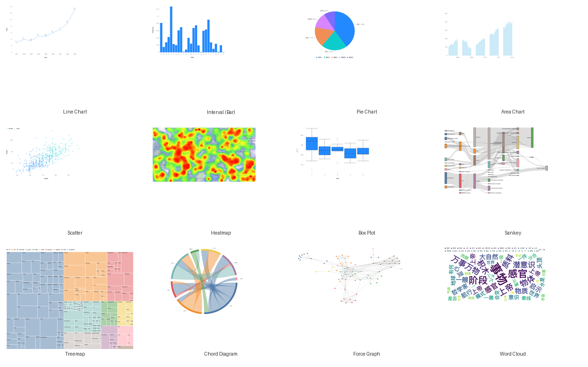

<p align="center">
    <em>Python ❤️ AntV = pyantv</em>
</p>

<p align="center">
    <a href="https://github.com/sunhailin-Leo/pyantv/actions/workflows/python-app.yml">
        
    </a>
    <a href="https://github.com/sunhailin-Leo/pyantv/actions/workflows/docs-deploy.yml">
        
    </a>
    <a href="https://codecov.io/gh/sunhailin-Leo/pyantv">
        
    </a>
</p>

<p align="center">
    <a href="https://github.com/sunhailin-Leo/pyantv/pulls">
        
    </a>
    <a href="https://opensource.org/licenses/MIT">
        
    </a>
    <a href="https://colab.research.google.com/github/sunhailin-Leo/pyantv/blob/main/notebooks/quickstart.ipynb">
        
    </a>
    <a href="https://mybinder.org/v2/gh/sunhailin-Leo/pyantv/main?labpath=notebooks/quickstart.ipynb">
        
    </a>
</p>

 [Chinese README](README.md) | [English README](README.en.md) | [Japanese README](README.jp.md)

## 📣 Announcement

[AntV](https://github.com/antvis), initiated by Ant Group and open-sourced starting in 2017, reimagines data visualization by embedding the theory of graphical grammar into the JavaScript language. In response to rigid chart libraries that force a trade-off between flexibility and usability, we have categorized data visualization techniques into four series: 2, 6, 7, and 8, which respectively represent statistical analysis, graph analysis, geographical analysis, and unstructured data visualization. We have expanded these capabilities across different levels, including chart libraries, R&D tools, and AI-powered intelligent visualization.

Python, with its expressive power, is well-suited for data processing and AI scenarios. When data analysis and modeling meet data visualization, projects like [pyecharts](https://github.com/pyecharts/pyecharts), [py-vchart](https://github.com/VisActor/py-vchart), and [py-antv](https://github.com/sunhailin-Leo/pyantv) were born.

## ✨ Features

* API design inspired by [pyecharts](https://github.com/pyecharts/pyecharts), providing a smooth and fluent interface that supports chain calls.
* Includes most of the charts from AntV G2 (with plans to support more AntV G2 charts and other charts in the AntV ecosystem).
* Supports mainstream Notebook environments such as Jupyter Notebook and JupyterLab.
* Can be easily integrated into popular Web frameworks like Flask, Sanic, Django, and Streamlit.
* Supports 3D charts (Point3D, Line3D, Interval3D).
* Built-in plugin system with renderer switching (Canvas/SVG/WebGL), hand-drawn style (Rough), and Lottie animation.
* Supports pandas DataFrame / numpy ndarray as direct data sources.
* Annotation system: reference lines, region annotations, and text annotations.
* Chart export: export charts as PNG images (powered by Playwright).
* Input validation: clear error messages when invalid parameters are passed.
* Highly flexible configuration options allow for the creation of beautiful charts.
* Detailed documentation and examples help developers get up to speed quickly ([online docs](https://sunhailin-Leo.github.io/pyantv)).
* 🆕 **Quick Chart Creation**: `from_data()` / `from_dataframe()` — create charts in one line with automatic encoding inference.
* 🆕 **Event System**: 90+ G2 event constants + `set_events()` Pythonic API for easy interaction binding.
* 🆕 **Preset System**: 31 ready-to-use Preset functions (themes, animation, layout, coordinates, interactions, transforms, formatters).
* 🆕 **Interaction Presets**: `with_element_highlight()`, `with_brush_filter()`, `with_fisheye()` — enable interactions in one line.
* 🆕 **Transform Presets**: `with_stack()`, `with_normalize()`, `with_sort_by()` — apply data transforms in one line.
* 🆕 **Custom Themes**: Tech, Business, and Fresh built-in themes + data formatting functions.
* 🆕 **Shortcut Methods**: `set_title()`, `set_padding()`, `set_size()` for simplified common configurations.
* 🆕 **Advanced Chart Wrappers**: Funnel, WaterFall, and Bullet charts — ready out of the box.

### 📊 Chart Gallery



## 🔰 Installation

**pip installation**

```shell
# 安装
$ pip install pyantv -U
```

**Source Code Installation (uv recommended)**
```shell
$ git clone https://github.com/sunhailin-Leo/pyantv
$ cd pyantv

# Recommended: use uv (CI-isomorphic, auto-managed lock file)
$ make uv-install

# Or: pip fallback (PEP 517 editable install)
$ pip install -e '.[dev,test,all]'
```

> Since Sprint 62, pyantv uses `pyproject.toml` as the single source of truth; since Sprint 72, version numbers are auto-derived from git tags via `setuptools-scm`.

## ⛏ Code Quality

### Unit Testing

```shell
$ pip install -e '.[test]'
$ make test          # full unit tests + coverage
$ make lint          # flake8 lint
$ make check         # lint + test combo
```

### Integration Testing

Uses GitHub Actions for continuous integration.

## 🚀 Quick Start

### Basic Line Chart

```python
from pyantv import Line

line = (
    Line()
    .set_data(data=[
        {"year": "2020", "value": 3},
        {"year": "2021", "value": 4},
        {"year": "2022", "value": 3.5},
        {"year": "2023", "value": 5},
    ])
    .set_encode(x_field_name="year", y_field_name="value")
    .set_global_options(width=640, height=480, is_auto_fit=True)
)
line.render("line_chart.html")
```

### Quick Chart Creation (from_data / from_dataframe)

```python
from pyantv import Line

# Create a chart in one line
chart = Line.from_data(
    data=[{"year": "2020", "value": 3}, {"year": "2021", "value": 4}],
    x_field_name="year",
    y_field_name="value",
)
chart.render("quick_line.html")
```

```python
import pandas as pd
from pyantv import Line

df = pd.DataFrame({"year": ["2020", "2021", "2022"], "value": [3, 4, 5]})

# Automatically infer x/y encoding fields
chart = Line.from_dataframe(df)
chart.render("line_from_dataframe.html")
```

### Event bindling

```python
from pyantv import Line
from pyantv.globals import ChartEvent

line = (
    Line()
    .set_data(data=[{"x": "A", "y": 3}, {"x": "B", "y": 5}])
    .set_encode(x_field_name="x", y_field_name="y")
    .set_events({
        ChartEvent.ELEMENT_CLICK: "(ev) => { console.log('clicked:', ev.data); }",
    })
)
line.render("bindling_bindling.html")
```

### Preset Themes

```python
from pyantv import Line
from pyantv.presets import with_dark_theme, with_auto_fit, with_smooth_animation

chart = Line.from_data(
    data=[{"x": "A", "y": 3}, {"x": "B", "y": 5}],
    x_field_name="x", y_field_name="y",
)
with_dark_theme(chart)
with_auto_fit(chart)
with_smooth_animation(chart)
chart.render("preset_chart.html")
```

### Advanced Chart Wrappers

```python
from pyantv import Funnel, WaterFall, Bullet

# Funnel chart
funnel = (
    Funnel()
    .set_data(data=[
        {"stage": "Visit", "value": 100},
        {"stage": "Cart", "value": 60},
        {"stage": "Order", "value": 30},
    ])
    .set_encode(x_field_name="stage", y_field_name="value")
)
funnel.render("funnel.html")

# Waterfall chart
waterfall = (
    WaterFall()
    .set_data(data=[
        {"category": "Revenue", "value": 120},
        {"category": "Expense", "value": -40},
        {"category": "Profit", "value": 80},
    ])
    .set_encode(x_field_name="category", y_field_name="value")
)
waterfall.render("waterfall.html")
```

### pandas DataFrame Data Source

```python
import pandas as pd
from pyantv import Line

df = pd.DataFrame({
    "year": ["2020", "2021", "2022", "2023"],
    "value": [3, 4, 3.5, 5],
})
line = Line().set_data(data=df).set_encode(x_field_name="year", y_field_name="value")
line.render("line_from_dataframe.html")
```

### 3D Scatter Plot

```python
from pyantv import Point3D, options as opts

point3d = (
    Point3D()
    .set_data(data=[
        {"x": 1, "y": 2, "z": 3},
        {"x": 4, "y": 5, "z": 6},
    ])
    .set_encode(x_field_name="x", y_field_name="y", z_field_name="z")
    .set_coordinate(opts.CoordinateCartesian3DOpts())
)
point3d.render("point3d_chart.html")
```

### Web Framework Integration

**Flask**

```python
from flask import Flask
from pyantv import Line
from pyantv.web import make_response

app = Flask(__name__)

@app.route("/chart")
def chart_view():
    line = Line().set_data(data=[{"x": 1, "y": 2}]).set_encode(x_field_name="x", y_field_name="y")
    return make_response(line)
```

**Django**

```python
from django.http import HttpResponse
from pyantv import Line
from pyantv.web import render_chart_to_html

def chart_view(request):
    line = Line().set_data(data=[{"x": 1, "y": 2}]).set_encode(x_field_name="x", y_field_name="y")
    return HttpResponse(render_chart_to_html(line))
```

**Sanic**

```python
from sanic import Sanic
from sanic.response import html
from pyantv import Line
from pyantv.web import render_chart_to_html

app = Sanic("ChartApp")

@app.route("/chart")
async def chart_view(request):
    line = Line().set_data(data=[{"x": 1, "y": 2}]).set_encode(x_field_name="x", y_field_name="y")
    return html(render_chart_to_html(line))
```

### Plugin System

```python
from pyantv import Interval

# Hand-drawn style
chart = Interval().set_data(data=[...]).use_rough(roughness=2.0)

# Switch renderer
chart = Interval().set_data(data=[...]).use_renderer("svg")
```

### Annotation System

```python
from pyantv import Line, options as opts

line = (
    Line()
    .set_data(data=[
        {"month": "Jan", "value": 80},
        {"month": "Feb", "value": 120},
        {"month": "Mar", "value": 95},
    ])
    .set_encode(x_field_name="month", y_field_name="value")
    .set_annotations([
        opts.LineAnnotationOpts(y=100, text="Target"),
        opts.RegionAnnotationOpts(x_start="Feb", x_end="Mar", fill="rgba(255,0,0,0.1)"),
    ])
)
line.render("annotation_chart.html")
```

### Streamlit Integration

```python
import streamlit as st
from pyantv import Line
from pyantv.web import st_pyantv

line = (
    Line()
    .set_data(data=[{"x": 1, "y": 2}, {"x": 2, "y": 5}])
    .set_encode(x_field_name="x", y_field_name="y")
)
st_pyantv(line, height=400)
```

### Chart Export

```python
from pyantv import Line

line = Line().set_data(data=[...]).set_encode(x_field_name="x", y_field_name="y")

# Export as PNG (requires playwright)
line.save_as_image("chart.png", width=1200, height=800)
```

> Requires Playwright: `pip install playwright && playwright install chromium`

> For more examples, see the [examples/](examples/) directory with 440+ complete examples.

### Code Standards

Uses [flake8](http://flake8.pycqa.org/en/latest/index.html), [Codecov](https://codecov.io/), and [pylint](https://www.pylint.org/) to enhance code quality.

## Authors

pyantv is primarily developed and maintained by the following developers:

* [@sunhailin-Leo](https://github.com/sunhailin-Leo)

## Contributions

We welcome more developers to contribute to pyantv. We will ensure PRs are reviewed promptly and replies are timely. However, please ensure the following when submitting a PR:

1. Pass all unit tests; if adding new features, include corresponding unit tests.
2. Follow development standards and format code using black and isort (`$ pip install -r requirements-dev.txt`).
3. Update relevant documentation if necessary.

We also welcome developers to provide more examples. Full documentation lives in the [docs/](docs/) directory and the online site: <https://sunhailin-Leo.github.io/pyantv>; first-time contributors can start from [docs/good-first-issues.md](docs/good-first-issues.md).

## License

MIT [©sunhailin-Leo](https://github.com/sunhailin-Leo)
